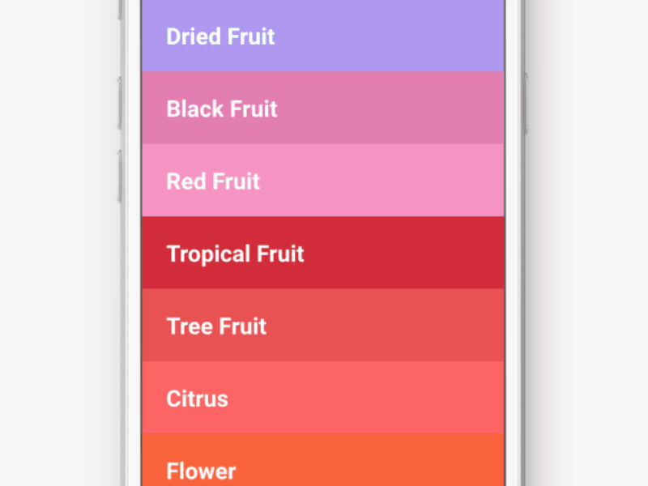

# Rainbow – reactjs, express, and webpack

React infinite scrolling rainbow color wheel. Elastic, watch as it adapts to the size of the viewport. Extend the data file to be anything you want/need.



### Install
First clone or download the app to your local machine, then install all dependencies with:
```sh
$ npm install
```

### Run
Running the app is an easy few steps after you've installed it. First boot the express server that is included by running:
```sh
$ npm start
```
You should be able to view the app in your web browser at: http://localhost:8080.

### Dev
Want to contribute? Great!

To develop, you'll need to make sure that webpack is watching for changes that you save so that it can auto bundle everything together.
To set up a webpack watcher to bundle upon each save:
```sh
$ npm run dev
```
To bundle one time and NOT run a watch:
```sh
$ npm run build
```

Hope you enjoy, cheers!
